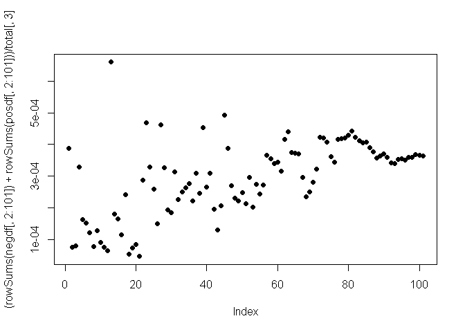
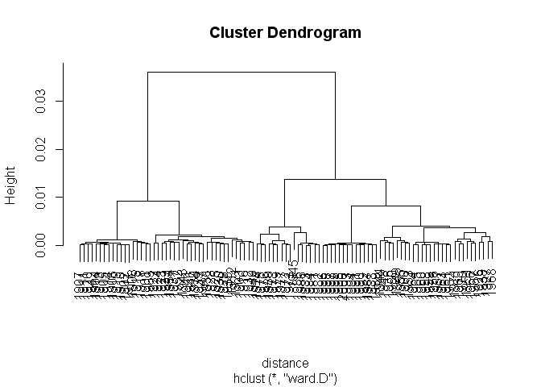
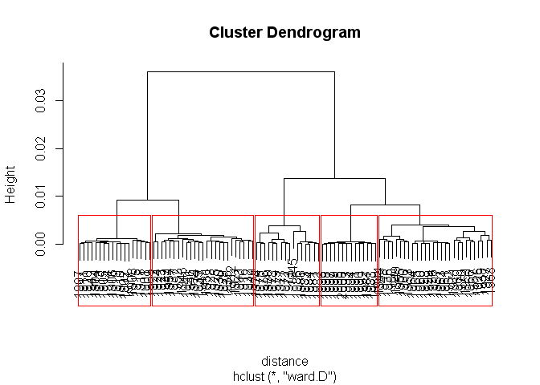
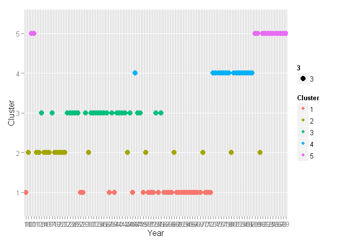

# Expression of Emotions in 20th Century Chinese Books
Ryan Cheung  
Thursday, August 15, 2014  

## Load in data 读入数据

```r
total <- read.table("summaryout.txt", header = T)
posdf <- read.csv("posdf.csv", stringsAsFactors = F, header = T)
negdf <- read.csv("negdf.csv", stringsAsFactors = F, header = T)
```

## General Usage of Emotion Words

```r
plot((rowSums(negdf[,2:101]) + rowSums(posdf[,2:101]))/total[,3], pch = 19,type = 'p')
```

 


## Creating DataFrame


```r
df <- as.data.frame(cbind(posdf[,2:595], negdf[,2:702]))
row.names(df) <- posdf[,1]
df <- df/total[,3]
```

## Clustering

### Hierarchical Clusting

```r
distance = dist(df, method = "euclidean")
clusterIntensity = hclust(distance, method="ward.D")
plot(clusterIntensity)
```

 

### Select 5 Cluster in HC

```r
plot(clusterIntensity)
rect.hclust(clusterIntensity, k = 5, border = "red")
```

 

```r
YearCluster = cutree(clusterIntensity, k = 5)
YearCluster
```

```
## 1900 1901 1902 1903 1904 1905 1906 1907 1908 1909 1910 1911 1912 1913 1914 
##    1    2    2    3    2    2    2    2    2    2    2    2    3    2    2 
## 1915 1916 1917 1918 1919 1920 1921 1922 1923 1924 1925 1926 1927 1928 1929 
##    2    3    2    2    2    2    3    3    3    3    3    1    1    3    3 
## 1930 1931 1932 1933 1934 1935 1936 1937 1938 1939 1940 1941 1942 1943 1944 
##    3    3    3    3    3    3    1    3    1    3    3    3    2    3    1 
## 1945 1946 1947 1948 1949 1950 1951 1952 1953 1954 1955 1956 1957 1958 1959 
##    4    3    3    1    1    1    1    3    1    3    1    1    1    1    1 
## 1960 1961 1962 1963 1964 1965 1966 1967 1968 1969 1970 1971 1972 1973 1974 
##    1    1    1    1    1    1    1    1    1    1    1    1    4    4    4 
## 1975 1976 1977 1978 1979 1980 1981 1982 1983 1984 1985 1986 1987 1988 1989 
##    4    4    4    4    4    4    4    4    4    4    4    4    5    5    5 
## 1990 1991 1992 1993 1994 1995 1996 1997 1998 1999 2000 
##    5    5    5    5    5    5    5    5    5    5    5
```

### Plot the clusters

```r
library(ggplot2)
Clusters <- as.data.frame(cbind(row.names(total), YearCluster))
names(Clusters) <- c('Year','Cluster')
Clusters$Cluster <- as.factor(Clusters$Cluster)
ggplot(Clusters, aes(x = Year, y = Cluster, color = Cluster, size = 3)) + geom_point()
```

 

### Write the Clusters to File

```r
write.csv(Clusters, file = "Clusters.csv", row.names = F)
```
