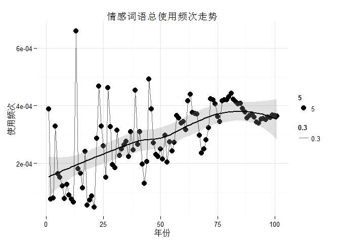
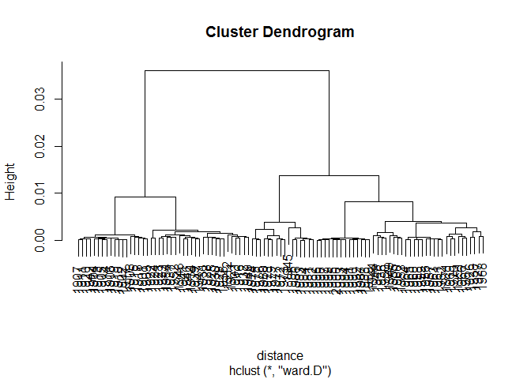
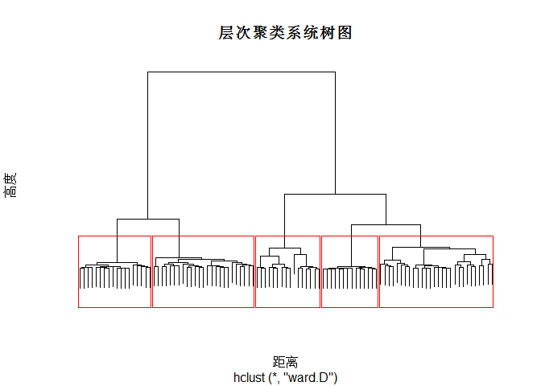
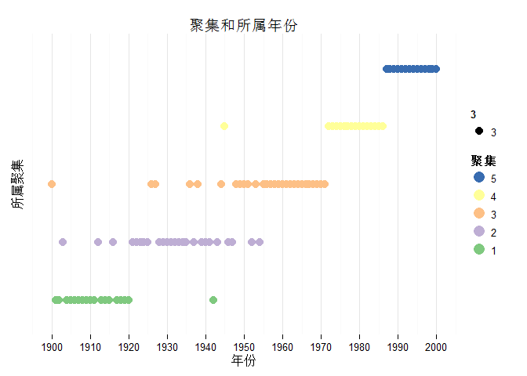

# Expression of Emotions in 20th Century Chinese Books
Ryan Cheung  
Thursday, August 15, 2014  

```r
library(ggplot2)
library(ggthemes)
theme_set(theme_minimal(12))
library(RColorBrewer)
```

## Load in data 读入数据

```r
total <- read.table("summaryout.txt", header = T)
posdf <- read.csv("posdf.csv", stringsAsFactors = F, header = T)
negdf <- read.csv("negdf.csv", stringsAsFactors = F, header = T)
```

## General Usage of Emotion Words

```r
x = (rowSums(negdf[,2:101]) + rowSums(posdf[,2:101]))/total[,3]
totalScore <- as.data.frame(x)
totalScore$y <- seq(1900:2000)
ggplot(aes(x = y, y = x), data = totalScore)+
  geom_point(aes(size = 5)) +
  stat_smooth(method = "loess",
              formula = y~x,
              size = 1,
              color = 'black',
              alpha = 0.3)+
  geom_line(aes(alpha = 0.3))+
  labs(title = "情感词语总使用频次走势", x= "年份", y = "使用频次")
```

 


## Creating DataFrame


```r
df <- as.data.frame(cbind(posdf[,2:595], negdf[,2:702]))
row.names(df) <- posdf[,1]
df <- df/total[,3]
```

## Clustering

### Hierarchical Clusting

```r
distance = dist(df, method = "euclidean")
clusterIntensity = hclust(distance, method="ward.D")
plot(clusterIntensity)
```

 

### Select 5 Cluster in HC

```r
plot(clusterIntensity, labels = F, axes = F, xlab = "距离", ylab = "高度", main = "层次聚类系统树图", ann = T)
rect.hclust(clusterIntensity, k = 5, border = "red")
```

 

```r
YearCluster = cutree(clusterIntensity, k = 5)
YearCluster
```

```
## 1900 1901 1902 1903 1904 1905 1906 1907 1908 1909 1910 1911 1912 1913 1914 
##    1    2    2    3    2    2    2    2    2    2    2    2    3    2    2 
## 1915 1916 1917 1918 1919 1920 1921 1922 1923 1924 1925 1926 1927 1928 1929 
##    2    3    2    2    2    2    3    3    3    3    3    1    1    3    3 
## 1930 1931 1932 1933 1934 1935 1936 1937 1938 1939 1940 1941 1942 1943 1944 
##    3    3    3    3    3    3    1    3    1    3    3    3    2    3    1 
## 1945 1946 1947 1948 1949 1950 1951 1952 1953 1954 1955 1956 1957 1958 1959 
##    4    3    3    1    1    1    1    3    1    3    1    1    1    1    1 
## 1960 1961 1962 1963 1964 1965 1966 1967 1968 1969 1970 1971 1972 1973 1974 
##    1    1    1    1    1    1    1    1    1    1    1    1    4    4    4 
## 1975 1976 1977 1978 1979 1980 1981 1982 1983 1984 1985 1986 1987 1988 1989 
##    4    4    4    4    4    4    4    4    4    4    4    4    5    5    5 
## 1990 1991 1992 1993 1994 1995 1996 1997 1998 1999 2000 
##    5    5    5    5    5    5    5    5    5    5    5
```

### Plot the clusters

```r
Clusters <- as.data.frame(cbind(row.names(total), YearCluster))
names(Clusters) <- c('Year','Cluster')
Clusters$Cluster <- as.numeric(Clusters$Cluster)
for (i in 1:101){
  if (Clusters$Cluster[i] == 1) Clusters$Cluster[i] = 3
  else if (Clusters$Cluster[i] == 2) Clusters$Cluster[i] = 1
  else if (Clusters$Cluster[i] == 3) Clusters$Cluster[i] = 2
}
Clusters$Cluster <- as.factor(Clusters$Cluster)
Clusters$Year <- seq(1900,2000)
ggplot(Clusters, aes(x = Year, y = Cluster, color = Cluster, size = 3)) +
  geom_point() +
  scale_color_brewer(type = 'qual',
    guide = guide_legend(title = '聚集', reverse = T,
    override.aes = list(alpha = 1, size = 5))) +
  labs(title = "聚集和所属年份", x= "年份", y = "所属聚集") +
  scale_x_continuous(breaks = seq(1900,2000,10)) +
  scale_y_discrete(breaks = NULL)
```

 

### Write the Clusters to File

```r
write.csv(Clusters, file = "Clusters.csv", row.names = F)
```


```r
c1 = subset(df, Clusters$Cluster == 1)
c2 = subset(df, Clusters$Cluster == 2)
c3 = subset(df, Clusters$Cluster == 3)
c4 = subset(df, Clusters$Cluster == 4)
c5 = subset(df, Clusters$Cluster == 5)
names(sort(colSums(c1), decreasing = T)[1:50])
```

```
##  [1] "用"   "期"   "应"   "要"   "重"   "安"   "说"   "向"   "好"   "批准"
## [11] "过"   "准"   "斗争" "美"   "奉"   "注意" "称"   "想"   "敢"   "系"  
## [21] "同意" "需"   "责"   "管"   "希望" "轻"   "气"   "原"   "需要" "容"  
## [31] "斗"   "批"   "巴"   "难"   "注"   "爱"   "欲"   "尚"   "讨"   "甘"  
## [41] "思"   "满"   "怒"   "支持" "讲"   "认"   "快"   "尽"   "许"   "肯"
```

```r
names(sort(colSums(c2), decreasing = T)[1:50])
```

```
##  [1] "用"   "要"   "好"   "期"   "说"   "需要" "向"   "注意" "应"   "希望"
## [11] "想"   "过"   "重"   "美"   "通过" "斗争" "原"   "称"   "批准" "接受"
## [21] "需"   "安"   "满足" "支持" "快"   "系"   "集中" "同意" "容"   "批"  
## [31] "敢"   "准"   "尽"   "难"   "怕"   "爱"   "肯定" "提倡" "望"   "轻"  
## [41] "主持" "认"   "气"   "注"   "巴"   "满意" "思"   "满"   "管"   "推"
```

```r
names(sort(colSums(c3), decreasing = T)[1:50])
```

```
##  [1] "要"   "说"   "好"   "用"   "应"   "斗争" "期"   "向"   "过"   "需要"
## [11] "想"   "通过" "注意" "希望" "支持" "美"   "重"   "接受" "快"   "集中"
## [21] "同意" "批准" "系"   "需"   "原"   "欢迎" "难"   "满足" "批"   "肯定"
## [31] "称"   "尽"   "准"   "抓"   "巴"   "讲"   "安"   "愿意" "喜欢" "攻击"
## [41] "关心" "斗"   "认"   "管"   "怕"   "拥护" "怀疑" "容"   "倾向" "爱"
```

```r
names(sort(colSums(c4), decreasing = T)[1:50])
```

```
##  [1] "说"   "要"   "斗争" "好"   "用"   "过"   "应"   "向"   "需要" "通过"
## [11] "想"   "期"   "注意" "希望" "支持" "快"   "重"   "集中" "美"   "接受"
## [21] "系"   "同意" "重视" "讲"   "满足" "肯定" "抓"   "难"   "称"   "原"  
## [31] "欢迎" "批"   "倾向" "尽"   "需"   "喜欢" "维护" "轻"   "认"   "准"  
## [41] "感"   "关心" "教训" "批准" "愿意" "攻击" "允许" "高兴" "巴"   "气"
```

```r
names(sort(colSums(c5), decreasing = T)[1:50])
```

```
##  [1] "说"   "要"   "好"   "应"   "通过" "用"   "向"   "需要" "过"   "期"  
## [11] "斗争" "想"   "注意" "支持" "美"   "集中" "接受" "希望" "系"   "重"  
## [21] "重视" "批准" "快"   "原"   "满足" "称"   "批"   "难"   "需"   "维护"
## [31] "抓"   "肯定" "管"   "讲"   "同意" "尽"   "允许" "感"   "准"   "倾向"
## [41] "企"   "认"   "欢迎" "喜欢" "关心" "忽视" "愿意" "主持" "安"   "轻"
```


