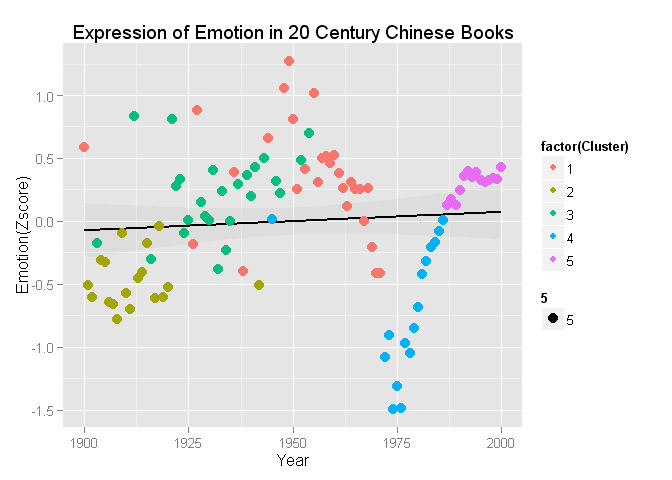
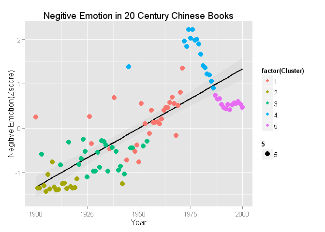

# Expression of Emotions in 20th Century Chinese Books
Ryan Cheung  
Thursday, August 07, 2014  

## Load in data 读入数据

```r
neg <- read.table("negsentiment.txt", header = T)
pos <- read.table("possentiment.txt", header = T)
total <- read.table("summaryout.txt", header = T)
clusters <- read.csv("Clusters.csv", header = T)
```

## 计算各年的情感值 Calculate mood scores
### 以总1gram频次正则化


```r
# freqneg are the frequencies of a postive mood word
freqneg <- neg[,2]/total[,3]
# MNEG are the negative mood scores for each year
MNEG <- 1/702*freqneg
# MZNEG are the standardized negative mood scores for each year
MZNEG <- (MNEG - mean(MNEG))/sd(MNEG)

# freqpos are the frequencies of a postive mood word
freqpos <- pos[,2]/total[,3]
# MPOS are the positive mood scores for each year
MPOS <- 1/595*freqpos
# MZPOS are the standardized positive mood scores for each year
MZPOS <- (MPOS - mean(MPOS))/sd(MPOS)

# sent are the difference in mood scores
sent <- freqpos - freqneg
# MZ are the standardized difference in mood scores
MZ <- MZPOS -MZNEG

df <- as.data.frame(cbind(pos[,1],freqneg,MZNEG,freqpos,MZPOS,sent,MZ, clusters[,2]))
names(df)[1] <- 'Year'
names(df)[8] <- 'Cluster'
```

### 绘制图

情绪差值的标准值图：

```r
library(ggplot2)
ggplot(df, aes(x = Year, y = MZ))+ stat_smooth(method = "lm", formula = y~x, size =1, color = 'black', alpha = 0.1)+ geom_point(aes(color = factor(Cluster),size = 5))+ labs(title = "Expression of Emotion in 20 Century Chinese Books", x= "Year", y = "Emotion(Zscore)")
```

 


正面情感词各年频次：

```r
ggplot(df, aes(x = Year, y = MZPOS))+ stat_smooth(method = "lm", formula = y~x, size =1, color = 'black', alpha = 0.1)+ geom_point(aes(color = factor(Cluster),size = 5))+ labs(title = "Positive Emotion in 20 Century Chinese Books", x= "Year", y = "Positive Emotion(Zscore)")
```

 

负面情感词各年频次：

```r
ggplot(df, aes(x = Year, y = MZNEG))+ stat_smooth(method = "lm", formula = y~x, size =1, color = 'black', alpha = 0.1)+ geom_point(aes(color = factor(Cluster),size = 5))+ labs(title = "Negitive Emotion in 20 Century Chinese Books", x= "Year", y = "Negitive Emotion(Zscore)")
```

 

### Write out sentiment data

```r
write.csv(df, 'sentiment.csv')
```

