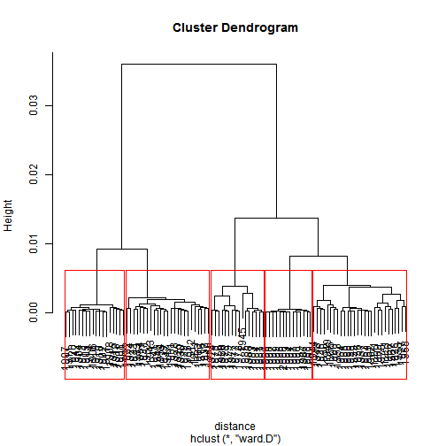
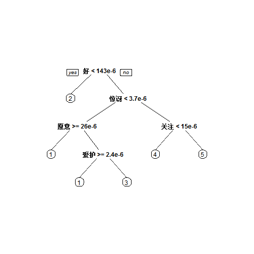
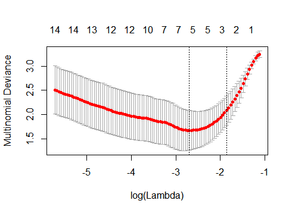

二十世纪中文图书中的情感变化
====================================================

 

总体而言情感值呈现上升趋势，在1940-1960年间有显著上升迹象，文化大革命（1966-1976）年间出现显著跌落。。。  

  

层次聚类为5个明显聚集

  
聚集1-5分别大致对应于：   
1：1949-1966 新中国成立到文化大革命前    
2：1900-1922 1900年到共党、民国成立   
3：1922-1949 共党、民国成立到新中国建立   
4：1966-1977 文革期间   
5：1978-2000 改革开放以来   

              
用分类树模型根据词频矩阵预测其所属聚集，发现只需要5个词即可知道年份,5个词为：    
好、惊讶、关注、愿意、爱护    

                 
训练Lasso模型的也表示，5个词作Feature就足够好了。    

分析图的生成过程详情见 log.md .

Expression of Emotions in 20th Century Chinese Books 由 Ryan Cheung 创作，采用 知识共享 署名-非商业性使用-相同方式共享 4.0 国际 许可协议进行许可。     
基于https://github.com/ryancheunggit/Expression_of_Emotions_in_20th_Century_Chinese_Books/上的作品创作。
本许可协议授权之外的使用权限可以从 ryanzjlib@gmail.com 处获得。
