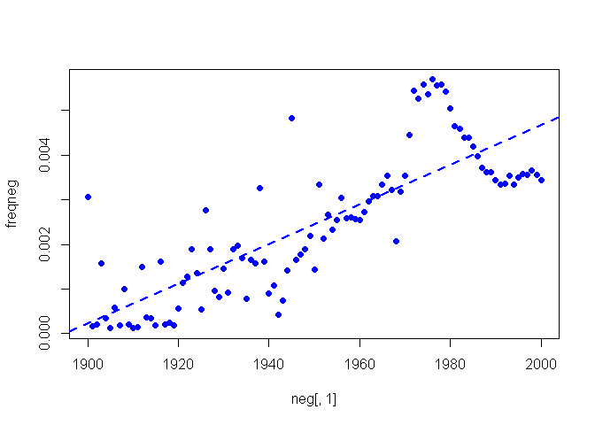
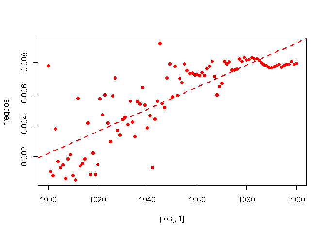
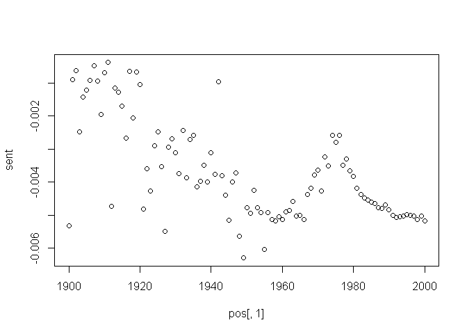
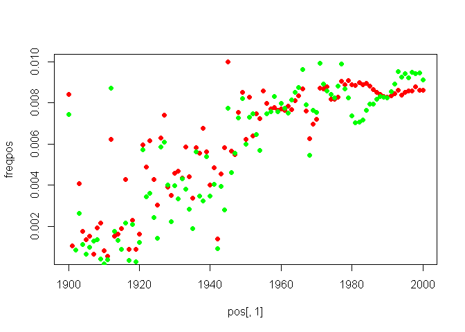

# Expression of Emotions in 20th Century Chinese Books
Ryan Cheung  
Thursday, August 07, 2014  

## Load in data 读入数据

```r
neg <- read.table("negsentiment.txt", header = T)
pos <- read.table("possentiment.txt", header = T)
total <- read.table("summaryout.txt", header = T)
```

## 计算各年的情感值 Calculate mood scores
### 以总1gram频次正则化


```r
freqneg <- neg[,2]/total[,3]
freqpos <- pos[,2]/total[,3]
sent <- freqpos - freqneg
poslm <- lm(freqpos~pos[,1])
neglm <- lm(-freqneg~neg[,1])
neglmp <- lm(freqneg~neg[,1])
sentlm <- lm(sent~pos[,1])
```
### 绘制图

负面情感词各年频次：

```r
plot(neg[,1], freqneg, pch = 19, col = 'blue')
abline(neglmp$coefficients[1],neglmp$coefficients[2], col = 'blue', lty = 2, lwd = 2)
```

 

正面情感词各年频次：

```r
plot(pos[,1], freqpos, pch = 19, col = 'red')
abline(poslm$coefficients[1],poslm$coefficients[2], col = 'red', lty = 2, lwd = 2)
```

 

情感值（正面情感各年频次-负面情感各年频次）随年份的变化：

```r
plot(pos[,1], sent, pch = 19, col = 'black')
abline(sentlm$coefficients[1],sentlm$coefficients[2], col = 'red', lty = 2, lwd = 2)
```

 

三者放在一张图上：

```r
plot( 1900:2000, seq(-0.008,0.012,0.02/100), type = "n", xlab = "year", ylab = "sentiment") 
points(pos[,1], sent, col = 'black', pch = 19)
abline(sentlm$coefficients[1],sentlm$coefficients[2], col = 'black', lty = 2, lwd = 2)
points(neg[,1], -freqneg, col = 'blue', pch = 19)
abline(neglm$coefficients[1],neglm$coefficients[2], col = 'blue', lty = 2, lwd = 2)
points(pos[,1], freqpos, col = 'red', pch = 19)
abline(poslm$coefficients[1],poslm$coefficients[2], col = 'red', lty = 2, lwd = 2)
```

 


## 相关性检验
### 读入词频矩阵

```r
posdf <- read.csv("posdf.csv", stringsAsFactors = F, header = T)
negdf <- read.csv("negdf.csv", stringsAsFactors = F, header = T)
```

### 计算相关性

```r
poscor <- rep(0,ncol(posdf)-1)
negcor <- rep(0,ncol(negdf)-1)
for (i in 2:ncol(posdf)){
  poscor[i-1] = cor(freqpos, posdf[,i]/total[,3])
}
for (i in 2:ncol(negdf)){
  negcor[i-1] = cor(freqneg, negdf[,i]/total[,3])
}
```

### 找出最能代表正面情感走势和负面情感走势的词语

```r
top10poscorscore <- sort(poscor, T)[1:10]
top10posterm <- rep("",10)
for (i in 1:10){
  top10posterm[i] = names(posdf)[which(poscor == top10poscorscore[i])+1]
}
top10posterm
```

```
##  [1] "向"   "要"   "过"   "快"   "集中" "好"   "给"   "尽"   "肯定" "接受"
```

```r
top10negcorscore <- sort(negcor, T)[1:10]
top10negterm <- rep("",10)
for (i in 1:10){
  top10negterm[i] = names(negdf)[which(negcor == top10negcorscore[i])+1]
}
top10negterm
```

```
##  [1] "说"       "给"       "沉重"     "不顾"     "惊慌"     "向"      
##  [7] "教训"     "担心"     "摇摆"     "怒不可遏"
```


```r
plot(pos[,1], freqpos, pch = 19, col = 'red')
points(pos[,1], 23*posdf[,419]/total[,3], pch = 19, col = 'green')
```

 

